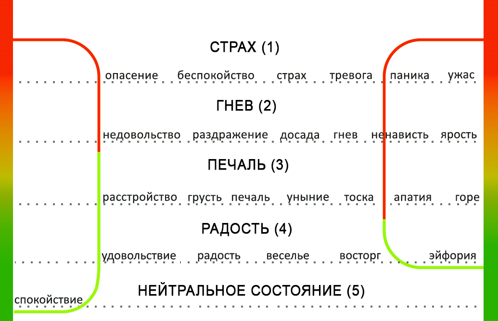
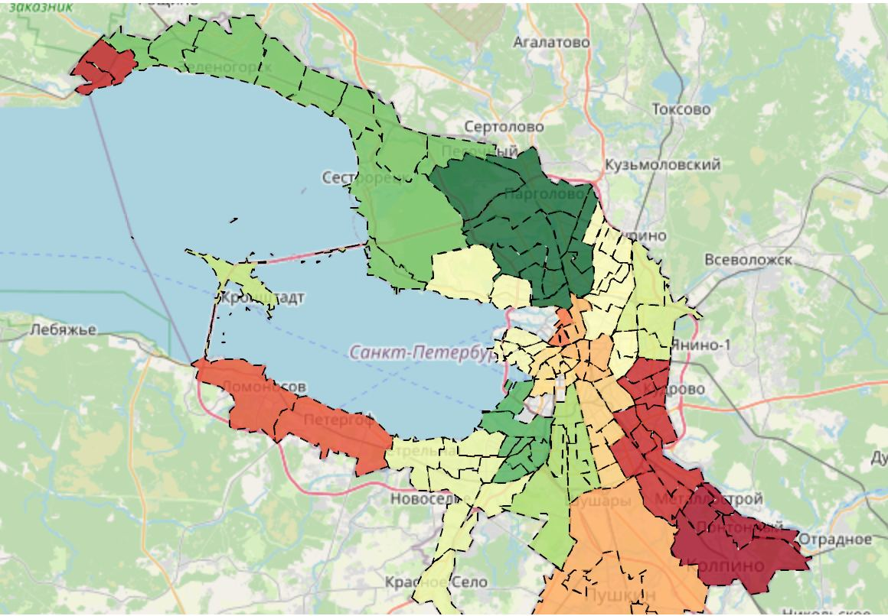
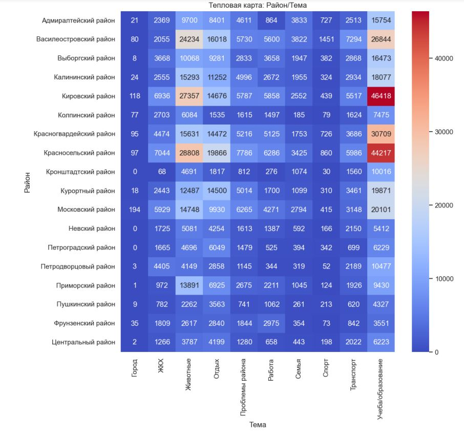

# spbmood-web
пилотные версии сервиса

## основная идея сервиса
Нами была разработана модель базовых эмоций  
(5 родительских классов эмоций и спектры дополнительных эмоций /подклассы/):

Далее мы проанализировали 412 сообществ в социальной сети ВКонтакте (анализ тональности).  
Так получилась карта эмоций жителей Санкт-Петербурга, 
 результаты исследования социальной сети ВКонтакте:

Также мы провели тематическое моделирование с апроксимацией до социальных ролей и сфер. 
Так получилась матрица корреляций: район-тема-эмоция:

Далее мы будем постепенно разрабатывать сервис, который сможет отразить эти данные, а также данные опроса и количественные данные о районах на одной карте.

Ниже будут появляться пилотные версии сервиса, проясняющие некоторые аспекты взаимодействия данных, а также дающие нам возможность работать над формализацией ТЗ.

- [X] **прототип 1**: 
выявление районов Санкт-Петербурга, нуждающихся в активном внедрении цифровых сервисов в сфере здравоохранения (в том числе дистанционного взаимодействия "клиника-пациент"): [прототип](https://petersburg-mood-project.github.io/spbmood-web/)

 
 
 _авторские права на изображения: изображения являются результатами исследований, таким образом, правообладатели изображений - коллектив авторов проекта_

