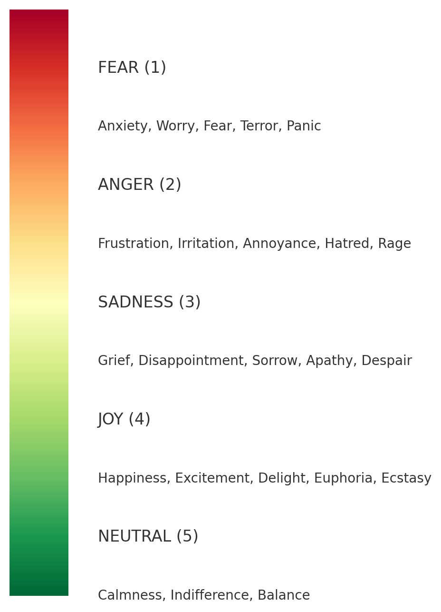
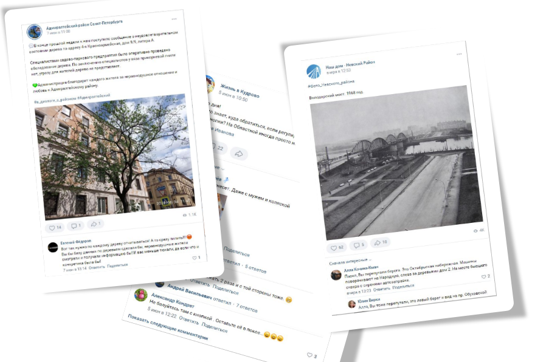

# spbmood-web
Веб-сервис социального картирования: центральный объект - размеченные карты города с разделением на маркеры социального самочувствия, а также социальные сферы с их соотнесением c эмоциямb, которые испытывают горожане.

---
## основная идея сервиса
Нами была разработана модель базовых эмоций  
(5 родительских классов эмоций и спектры дополнительных эмоций /подклассы/):

Далее мы проанализировали 412 сообществ в социальной сети ВКонтакте (анализ тональности).

  
Так получилась карта эмоций жителей Санкт-Петербурга, результаты исследования социальной сети ВКонтакте:

Также мы провели тематическое моделирование с апроксимацией до социальных ролей и сфер.
Так получилась матрица корреляций: район-тема-эмоция:

---
:white_check_mark: **Веб-сервис**: 
[spb-mood](https://petersburg-mood-project.github.io/spbmood-web/)

---
 
 
 
 
 

###### авторские права на изображения: изображения, представленные в этом репозитории, являются результатами исследований. таким образом, правообладатели изображений - коллектив авторов проекта.

